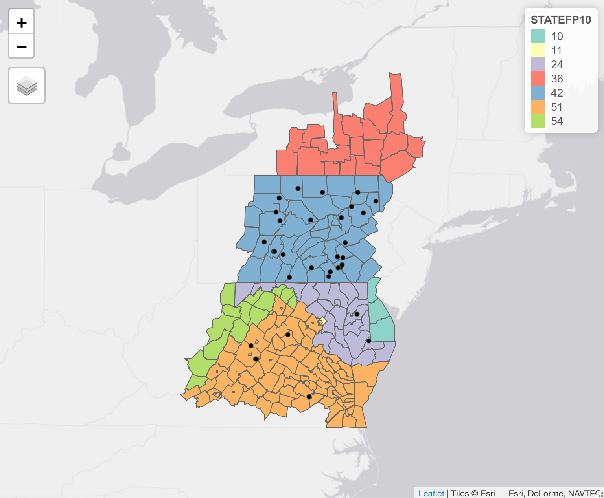

# GEOG 491/891: Special Topics - Spatial Analysis in R

## 

## Week 7.01: More spatial data operations

### Dr. Bitterman

## 

---

# Today's schedule

- Open discussion
- Topology and the "9-intersection model"
- Spatial data operations
- Activity

---

## Anything to discuss? Questions?


---

# today's setup

```r
library(tidyverse)
library(GISTools)
library(sf)
library(tmap)
```

---

# What does "topology" mean?

### ...and "ontology"?

### and why should we care?

---


# The "9-intersection model"


---

# Spatial predicates

- Equals
- Disjoint
- Touches (meets)
- Contains
- Covers
- Intersects
- Within (inside)
- Covered by
- Crosses
- Overlaps

---

# Spatial predicates in ```sf::```

- Equals ```st_equals```
- Disjoint ```st_disjoint```
- Touches (meets) ```st_touches```
- Contains ```st_contains```
- Covers ```st_covers```
- Intersects ```st_intersects```
- Within (inside) ```st_within```
- Covered by ```st_covered_by```
- Crosses ```st_crosses```
- Overlaps ```st_overlaps```

---

# Let's try some of them

---

# Today's data

```r
counties <- sf::read_sf("./data/CBW/County_Boundaries.shp") %>% sf::st_make_valid()

dams <- sf::read_sf("./data/CBW/Dam_or_Other_Blockage_Removed_2012_2017.shp") %>% sf::st_make_valid()

streams <- sf::read_sf("./data/CBW/Streams_Opened_by_Dam_Removal_2012_2017.shp") %>% sf::st_make_valid()
```

---


(no streams mapped)

---

# Remind me, how would we find the dams that are in Pennsylvania?

---

# First, let's get the counties in PA

```r
pa.counties <- counties %>% filter(STATEFP10 == 42)
```

---

# Dams in PA

### Multiple methods
```r
pa.dams <- st_intersection(dams, pa.counties)

# or

pa.dams <- dams[pa.counties,]
```

### How do these functions work? (and what do they output?)

---

# Let's use predicate to see the Boolean result

```r
st_intersects(dams, pa.counties)
```
### What's the output?

---

# Order matters

```r
# order matters
dams %>% st_intersects(x = ., y = pa.counties)
dams %>% st_intersects(x = pa.counties, y = .)
```
---

# Matrix output with the ```sparse``` parameter

### Try this
```r
# get a dense logical matrix
dams %>% st_intersects(x = ., y = pa.counties, sparse = F)
```
### How should we interpret the output?

---

# Other predicates

```r
# Disjoint
dams %>% st_disjoint(., pa.counties, sparse = F)

# Within
dams %>% st_within(., pa.counties, sparse = F)
```
---

# More examples

```r
streams.tioga %>% st_covered_by(., c.tioga)
tm_shape(c.tioga) + tm_polygons() + tm_shape(streams.tioga) + tm_lines(col = "blue")
```
### distance
```r
streams.tioga %>% st_is_within_distance(., dams, 1)
```
---

# Spatial joins

### How do *tabular* joins work?

### Spatial joins are similar, but use spatial relationships

---

# How we normally think about spatial joins...

*if A intersects B, then take the attributes from B, and join them to A*
(and discard all elements from B where "intersects" is false)

- This is how ArcGIS Pro works
- But we don't need to restrict ourselves to the "intersects" predicate


---

# calling ```sf::st_join```

### From the help menu...
```r
st_join(
  x,
  y,
  join = st_intersects,
  ...,
  suffix = c(".x", ".y"),
  left = TRUE,
  largest = FALSE
)
```

---

# A sptial join the "typical" way

```r
st_join(pa.counties, dams, join = st_intersects)
```

---

# But we can perform spatial joins using other predicates...

```r
st_join(pa.counties, dams, join = st_disjoint)
```

### or...
```r
st_join(pa.counties, streams, join = st_touches)
```
---

# Explore (try) some more yourself!

---

## For this week

- Chapter 4 here: https://geocompr.robinlovelace.net/spatial-operations.html 
- Practice, practice, practice
- Lab 02 - keep working
- Work on your projects (in-class updates on 10/29)

