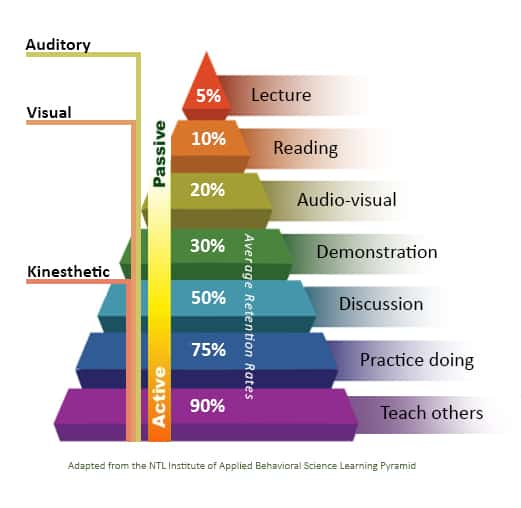

# GEOG 491/891: Special Topics - Spatial Analysis in R

## 

## Week 8.01: Geometry, data structures, and the flipped classroom

### Dr. Bitterman

## 

---

# Today's schedule

- Open discussion
- Something different
- For next class

---

## Anything to discuss? Questions?

---

# How do we (and you) learn best? Thoughts?

---

(in full disclosure, there are counterarguments to this pyramid)

---

# This week's activity

- You all read (or should have) Chapter 5 from Lovelace (https://geocompr.robinlovelace.net/geometric-operations.html)

- Instead of me providing you with a step-by-step walkthrough of the readings, **you're** going to do the teaching

- A quasi-"flipped classroom"

---

# What to do

- Form small groups (I've assigned the groups)
- Each group will be assigned a topic (or topics) from this week's readings
- Your tasks:
  - Develop a short lesson demonstrating the method(s)
  - Include:
    1. Learning objectives (what students will learn)
    2. Why the concepts/methods are important/relevant
    3. How a student would accomplish the task(s)
    4. A way to check for learning (and teaching != learning)

### All relevant resources can be found in the Lovelace chapter, but use what you think is relevant

---

# What you can use

- Anything
  - Web resources
  - Sample data
  - Whatever format you want (e.g., PowerPoint, R Markdown, something else)

---

# Tasks and teams

### Creating geometry and type transformations
- Bailey
- Iksoon

### Simplify, scale, shift, and rotate geometry
- Andy
- Uzma

### Raster aggregation, disaggregation, and resampling
- Jason
- Kun-Yuan
- Kidus

---

## For this week

- Wildcard Friday is no-class Friday
- Chapter 5 from Lovelace (https://geocompr.robinlovelace.net/geometric-operations.html)
- Practice, practice, practice
- Lab 02 - keep working
- Work on your projects (in-class updates on 10/29)

